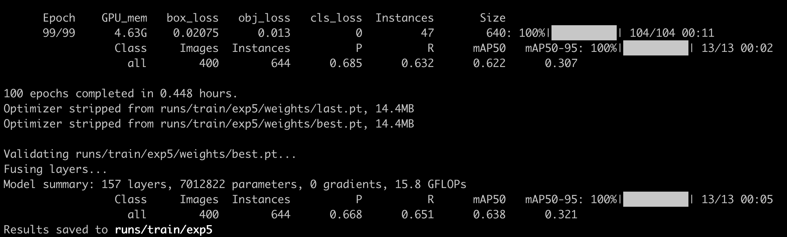
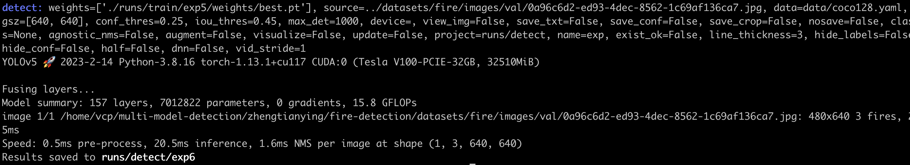

# Fire Detection

## 1 Background

Fast and accurate fire detection is very important to reduce fire damage. This project belongs to the object detection
problem in computer vision. This project uses the YOLOv5 model to identify fireworks. A dataset is formed by collecting
a large number of real fire images.

## 2 Requirements

- Python, PyTorch, and CUDA/CUDNN are preinstalled [we use pytorch>=1.7.0，python3.8，
cuda11.1 in the experiment]

- There is GPU RTX 2080 Ti used for data training

### 2.1 Install requirements

```shell
# clone this repo, then
cd ./fire-detection/yolov5
pip install -r requirements.txt
```

## 3 Preprocessing

- We use the fire detection dataset(train: 1660 images; val: 40 image) collected from network in
the experiment, and you can get the data
from [here](https://drive.google.com/file/d/1ydVpGphAJzVPCkUTcJxJhsnp_baGrZa7/view
). For the data processing, the `prepro.py` converts the VOC label format (.xml) to
yolo label format (.txt) and split the training and validating data.


```shell
python prepro.py \
  --data_root /Users/{USERNAME}/Downloads/VOC2020 # change yourself \
  --data_out_root ./datasets/fire # change yourself 
```


- Touch data yaml file in `yolov5/data` like `fire.yaml` (already contained in this repo), with content:

```yaml
path: ../dataset/fire/images
train: train
val: val

# Classes
names:
  0: fire
```

## 4 Model

We use the yolov5 github repo with branch v7.0 to train the fire detection model, i.e. `yolov5` directory same as github
repo except added `fire.yaml` file.

## 5 Train Model

```shell
cd yolov5
# maybe you should add MP_DUPLICATE_LIB_OK=TRUE to your env with mac os.
python train.py --data fire.yaml --epochs 100
```




## 6 Inference

```shell
cd yolov5;
# change exp3 to your exp
weights_file="./runs/train/exp5/weights/best.pt"
img_file="../datasets/fire/images/val/0a96c6d2-ed93-4dec-8562-1c69af136ca7.jpg"
python detect.py --weights ${weights_file} --source ${img_file}
```



The result of detection like this:


## Reference

1. https://github.com/ultralytics/yolov5


