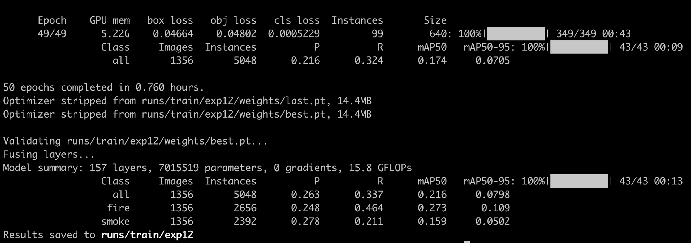
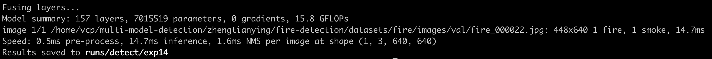
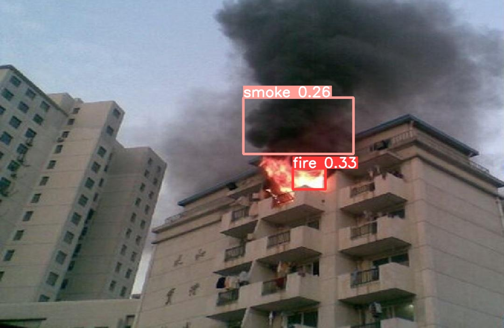

# Fire Smoke Detection

## 1 Background

Fast and accurate fire and smoke detection is crucial in reducing fire damage. This project addresses the object detection problem in computer vision using the YOLOv5 model to detect smoke and fire. The dataset used in this project contains two types of fire and smoke.

## 2 Requirements

- Python, PyTorch, and CUDA/CUDNN are preinstalled. In our experiments, we used pytorch>=1.7.0, python3.8, and cuda11.1.
- A GPU RTX 2080 Ti is used for data training.

### Install requirements

```shell
# clone this repo, then
cd ./fire-smoke-detection/yolov5
pip install -r requirements.txt
```

## 3 Preprocessing

- For our experiment, we used the fire detection dataset (train: 5585 images; val: 1357 images) collected from the network. You can obtain the data from [here](https://aistudio.baidu.com/aistudio/datasetdetail/107770
  ). For data processing, the `prepro.py` script converts the VOC label format (.xml) to the yolo label format (.txt) and splits the training and validation data.

```shell
python prepro.py \
  --data_root /Users/{USERNAME}/Downloads/dataset-fire-smoke \
  --data_out_root ./datasets/fire
```

- Then, touch a data yaml file in `yolov5/data` like `fire.yaml` (already contained in this repo), with the following content:

```yaml
path: ../dataset/fire/images
train: train
val: val

# Classes
names:
  0: fire
  1: smoke
```

## 4 Model

We used the YOLOv5 github repo with branch v7.0 to train the fire detection model. The `yolov5` directory is the same as the github repo, except we added the `fire.yaml` file.

## 5 Training the Model

```shell
cd yolov5
# maybe you should add MP_DUPLICATE_LIB_OK=TRUE to your env with mac os.
python train.py --data fire.yaml --epochs 50
```



## 6 Inference

```shell
cd yolov5

weights_file="./runs/train/exp12/weights/best.pt"
img_file="../datasets/fire/images/val/fire_000022.jpg"

python detect.py --weights ${weights_file} --source ${img_file}
```

The result of detection is shown below:





## Reference

1. https://github.com/ultralytics/yolov5
