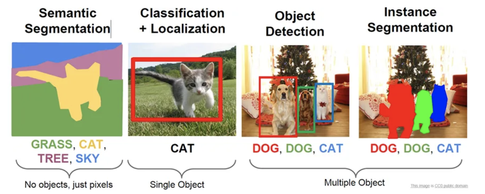
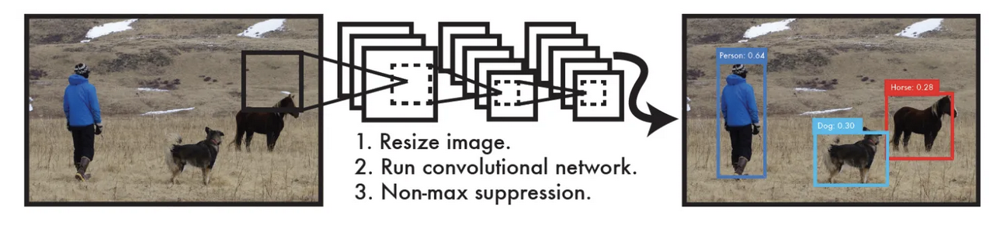
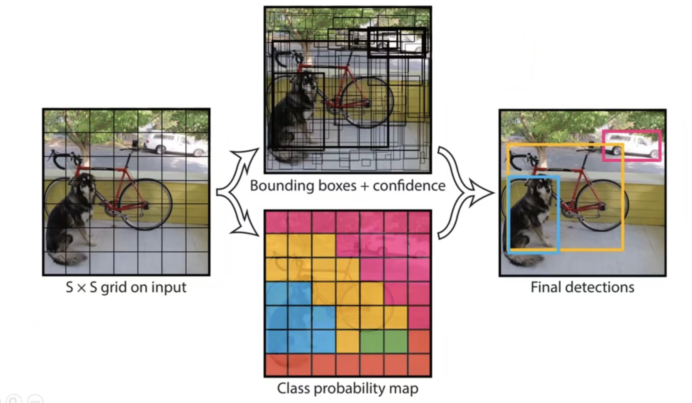
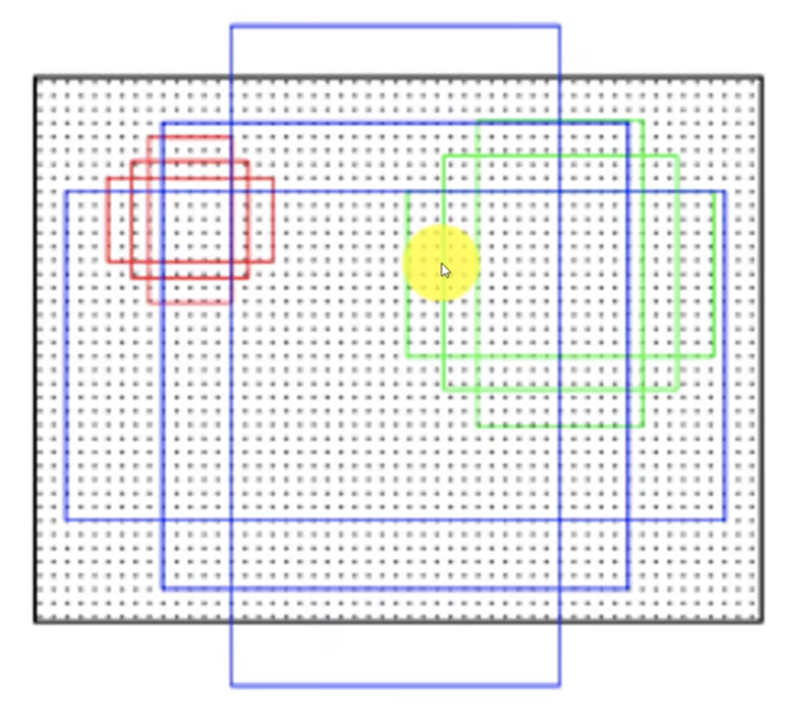
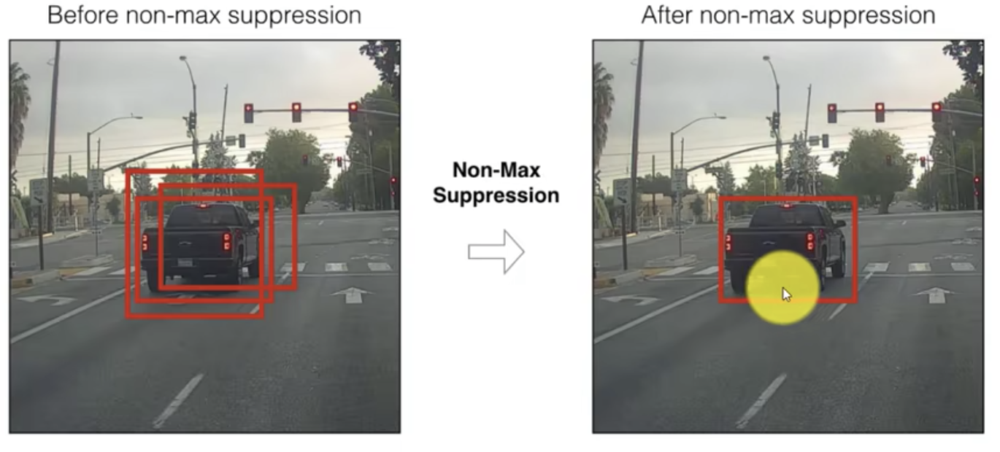
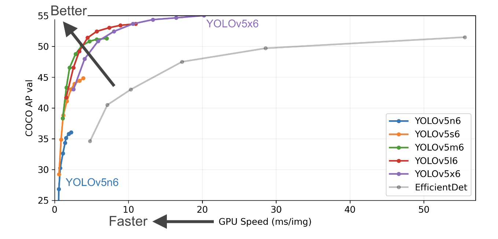
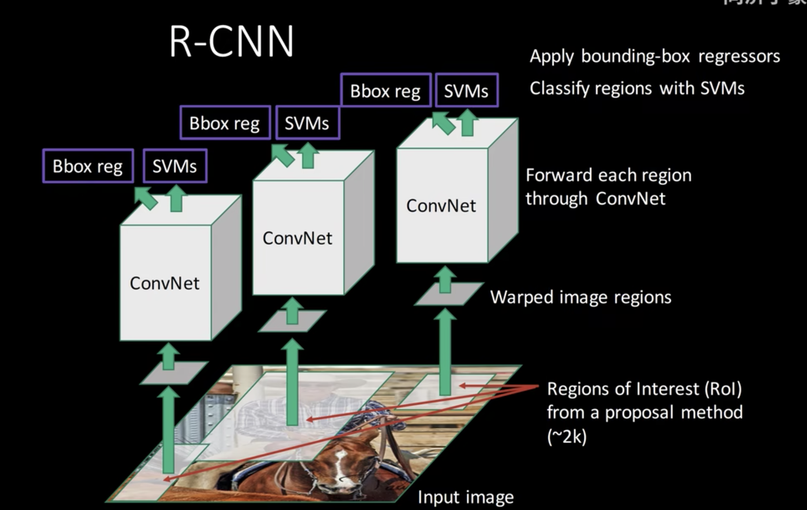

# A brief introduction to related models

## 1 Basic idea of YOLO algorithm

When we talk about computer vision, the first thing that comes to mind is image classification. Based on image
classification, there are more interesting tasks, such as object detection，object localization, semantic segmentation,
instance segmentation, etc., as shown in the figure below.

Among them, target detection is a more practical and challenging computer vision task, which can be regarded as a
combination of image classification and localization.
A practical application scenario of target detection is unmanned driving: if an effective target detection system can be
loaded on the unmanned vehicle, then the unmanned vehicle can quickly detect objects such as pedestrians and vehicles.
In recent years, object detection algorithms have made great breakthroughs. Target detection algorithms include R-CNN,
SPP-net, SSD, YOLO algorithm, etc.

One of the target detection algorithms is
the YOLO algorithm, which full name is You Only Look Once: Unified, Real-Time Object
Detection.

### 1.1 Design concept

Our goal is to find objects in an image and give its category and location. Target detection is based on supervised
learning. The supervision information of each picture is:

- N objects contained in the picture

- The center position (x, y) of the object, the height of the object, the width of the object, the category of the
  object

The YOLO algorithm divides the feature map into grid cells of S * S.
Each grid cell is responsible for detecting objects falling into it.
YOLO algorithm predicts bounding box and confidence and class probablity map of all grid cells.

The basic idea of the YOLO algorithm, see the figure below:

1. Divide the input image into an S*S grid. Each grid cell is equal in size.

2. After the algorithm, B bounding boxes for each box are predicted.
   The bounding box has 5 quantities, which are the center position (x, y) of the object and its height (h)
   and width (w), and confidence.
   The larger the confidence value, the more likely there is a target in the bounding box.

3. After the algorithm, the class probability map of each bounding box is predicted.

4. From 2, 3, we can get final detections.

### 1.2 Anchor

- The shape and size of the predefined anchor for each grid cell:

From the training data set, the shapes and sizes of several common anchors can be obtained. We add these common anchors
to the model, which helps the model to converge quickly. As shown in the figure below, anchors of three sizes are
obtained from a certain training data set: anchors of the red
class, anchors of the green class, and anchors of the blue class. The scale of the red class has 3 anchors, the scale of
the green class has 3 anchors, and the scale of the blue class
has 3 anchors.

- The number of predefined anchors for each grid cell:

We create a hyperparameter to represent the predefined number of anchors for each grid cell.

### 1.3 Non-Maximum Suppression

After the algorithm, B bounding boxes for each grid cell are predicted. After Non-Maximum Suppression, we remove some
redundant bounding boxes to get a suitable bounding box. As shown below:

## 2 YOLOv5 algorithm

YOLOv5 algorithm is faster than YOLOv4 algorithm while being comparable to the YOLOv4 benchmark in terms of accuracy.
YOLOv5 algorithm has a very lightweight model size. In the official code of YOLOv5 algorithm, there are 4 versions in
the given target detection network, namely YOLO5s,
YOLO5m, YOLO5l, YOLO5x four models.

YOLOv5 source code: https://link.zhihu.com/?target=https%3A//github.com/ultralytics/yolov5

### 2.1 Basic idea of YOLOv5 algorithm

Divide the input image into N*N grids. Then predict three indicators for each grid cell of the grid: bounding box,
confidence, and classification probability. Among:

- Bounding box: The size and precise location of the target.

- Confidence: The confidence level of the bounding box. The value range of the confidence is 0~1. The larger the
  confidence value, the more
  likely there is a target in the bounding box.

- Classification probability：class probablity map

So when actually testing:

Step1: Determine whether the confidence of each bounding box exceeds the set threshold. If it exceeds, it is considered
that there is a target in the bounding box, so as to obtain the approximate position of the target.

Step2: According to the Non-Maximum Suppression, we remove some redundant bounding boxes to get a suitable bounding box.

Step3: According to the class probablity map of the bounding box, the index corresponding to the maximum probability is
taken to obtain the category of the target.

### 2.2 Loss function of YOLOv5

The loss function of YOLOv5 includes:

- Classification loss: can be calculated with Binary cross entropy

- Localization loss: can be calculated with GIOU Loss

- Confidence loss: can be calculated with Binary cross entropy

total loss function = e1 * classification loss + e2 * localization loss + e3 * confidence loss

Among, e1, e2, e3 are weights, and their sum is 1.

### 2.3 Algorithm Performance Test Chart

The algorithm performance test graph of YOLOv5 is as follows:

The test performed by the author of YOLOv5 on the COCO dataset. According to the above figure, it can be obtained that
when the GPU Speed is the same, the AP accuracy of the YOLOv5s algorithm is the lowest. The higher the AP accuracy, the
higher the prediction accuracy of the model. The
other three algorithms, on this basis, continue to deepen and widen the network, and the AP accuracy is also
continuously improved, but the speed consumption is also increasing.

## 3 R-CNN

### 3.1 Basic idea of R-CNN

Step1. For the pictures in the training data set, we use the Selective Search algorithm to generate about 2000 candidate
boxes. These
candidate boxes may or may not be the final goal.

Step2. Scale the candidate frame of Step1 into a 227*227 square.

Step3. Input the squares of Step2 into the same ConvNet one by one to get the features.

Step4. Input features into SVM for classification; Input the features into the bounding box for regression.

Step5. We can get final detections.

### 3.2 Shortcomings of R-CNN

- The amount of calculation is large and the calculation is repeated. Extracting about 2000 candidate boxes through
  selective search requires a lot of calculations, and a lot of calculations are repeated.

- Multiple-stage pipeline：Training is divided into several stages.

- Training takes time and takes up a lot of disk space. The convoluted feature data must also be saved to the local
  disk.

